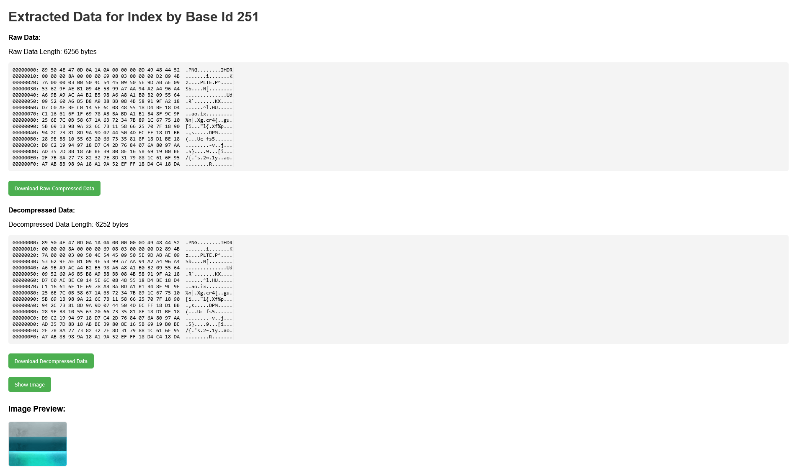

# Tarir - Guild Wars 2 Archive Decompression

**Tarir** is a Rust-based application using Actix Web to extract, decompress, and view data from Guild Wars 2 archive files. The data can be raw compressed data, decompressed data, and visualized as images. This project aims to provide a user-friendly interface for handling and viewing Guild Wars 2 archive files.

## Features

- **Extract Raw Data**: Download the raw compressed data from the archive.
- **Decompress Data**: View and download the decompressed data.
- **View Decompressed Image**: Display the decompressed image directly on the page.

## Usage

1. **Extracted Data**: When you visit the page for a specific file (based on its index number), you will see the raw compressed data, the decompressed data, and the decompressed image.
   
2. **Download Data**:
   - You can download the raw compressed data as a `.bin` file.
   - You can also download the decompressed data as a `.bin` file.

3. **View Decompressed Image**:
   - You can click the "Show Image" button to display the decompressed image on the page.

## How It Works

1. **Raw Data**: The raw data is extracted from the Guild Wars 2 archive file and displayed for reference. You can download the raw compressed data as a `.bin` file.

2. **Decompressed Data**: The data is decompressed and displayed for further inspection. You can also download the decompressed data as a `.bin` file.

3. **Decompressed Image**: The decompressed image (such as a texture or asset from the game) is displayed on the page when the "Show Image" button is clicked.

## Setup

### Requirements

- **Rust**: Ensure you have Rust installed on your machine.
- **Actix Web**: The project uses Actix Web for the web server.
- **Dependencies**: The project relies on several Rust libraries for decompression and handling binary files.

### Installation

1. Clone the repository to your local machine:

   ```bash
   git clone https://github.com/R-Hidayatullah/tarir.git
   ```

2. Navigate to the project directory:

   ```bash
   cd tarir
   ```

3. Build the project:

   ```bash
   cargo build --release
   ```

4. Run the server:

   ```bash
   cargo run
   ```

5. Access the web interface in your browser at `http://localhost:8080`.

### Configuration

- The server will serve the raw compressed data and decompressed data at the appropriate endpoints.

---

### Example Screenshot of Rendered Page

Below is an example of how the page might look when rendered, showing the extracted and decompressed data along with the decompressed image:



---

## Contributing

Feel free to fork the repository, submit issues, and create pull requests. Contributions are welcome!


